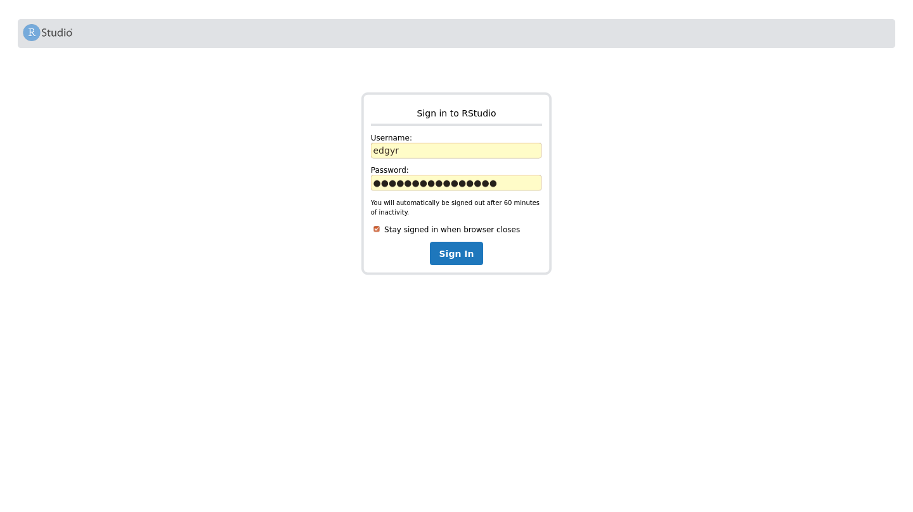
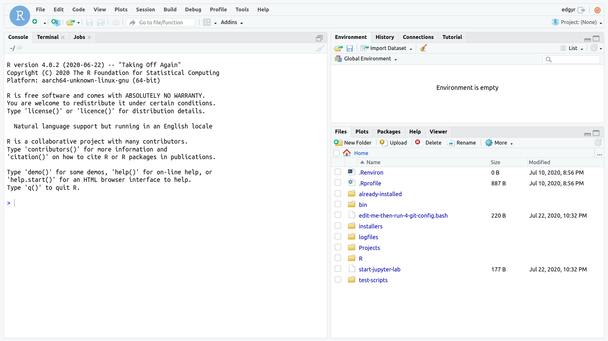
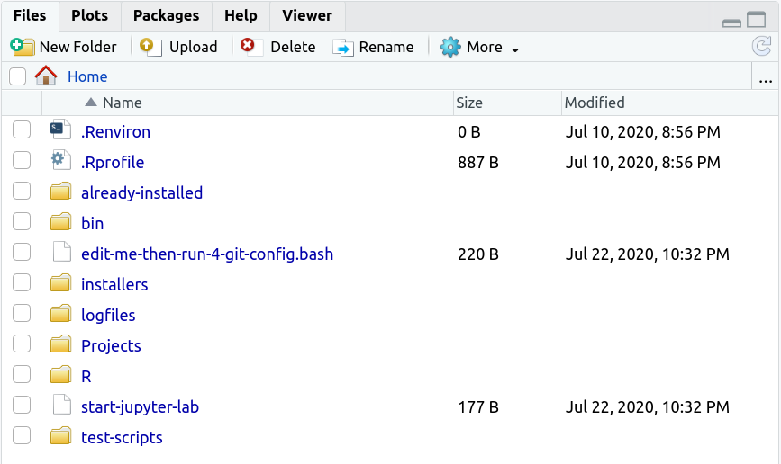

```{r, include = FALSE}
knitr::opts_chunk$set(
  collapse = TRUE,
  comment = "#>"
)
```

## Getting the repository

1. Open a terminal on the Jetson host machine. You can either do this from a
terminal window at the host console or logged in remotely via secure shell
(SSH).
2. Create a `Projects` directory and clone this repository into it.

    ```
    mkdir --parents Projects
    cd Projects
    git clone https://github.com/znmeb/edgyR.git
    cd edgyR/container-run-scripts
    ```

## Starting the `edgyr` container

1. Download the image: `./pull-edgyr-image`. You will need to enter your
Jetson password to run `sudo`.
2. Define a new password for the `edgyr` account in the container. For
security reasons, the container will exit if you do not do this. The new
password must be at least 12 characters long. Set the new password in the
environment variable `EDGYR_PASSWORD`. For example:

    `export EDGYR_PASSWORD="12.angry%characters"`
3. Start the container with `./run-edgyr`. You may have to enter your Jetson
password for `sudo` again.

    RStudio Server will start, listening on IP address `0.0.0.0` port `7878`.
    You should see
    
    ```
    ./run-edgyr
    Force-removing old 'edgyr' container
    You can ignore errors if it doesn't exist
    Error: No such container: edgyr
    Running image znmeb/edgyr-ml:latest
    fc04e5d9edbff7d2a7282d9680bd4db41009675ad1983d9e762e2c7144f2990c
    CONTAINER ID        IMAGE                   COMMAND                  CREATED             STATUS              PORTS               NAMES
    fc04e5d9edbf        znmeb/edgyr-ml:latest   "/docker-entrypoint.…"   6 seconds ago       Up 5 seconds                            edgyr
    Resetting 'edgyr' password
    Starting RStudio Server - browse to port 7878 on Docker host
    ```
    
    The long hexadecimal string will be different on your system, but the rest
    should look like what's above.
    
    This script runs the `edgyr` container in detached mode. The processes in
    the container are running in the background, and you can use the terminal
    for other operations.

## Using the container
You can use the container two ways - you can either browse to the RStudio
Server or log in to the command line from the terminal. Most users will want to
use RStudio, so we'll cover that first.

### Browsing to the RStudio Server

1. Browse to the server and log in. On the Jetson console, browse to
`localhost:7878`. On a remote system, browse to port `7878` on the IP address
of the Jetson host. ***Note that this is a different port number from the
RStudio Server default port number!***

    For example, my Jetson Nano has IP address `192.168.254.23`, so I browse
    to `http://192.168.254.23:7878`. The user name is `edgyr` and the password
    is the one you defined when you ran the container in step 3 above -- the
    value you set in the `EDGYR_PASSWORD` variable before you started the
    container.

    ```{r echo=FALSE, out.width='100%'}
    
    ```

--------------------

2. After you log in, you'll see the RStudio Server web application page.

    ```{r echo=FALSE, out.width='100%'}
    
    ```

--------------------

### Exploring the container

The RStudio Server web application page is the standard open source RStudio
Server "desktop". I find it useful to set the browser to full-screen mode when
using it to minimize distractions.

The `Files` pane shows some of the extras that are installed on the image and
are available to you in the container.

```{r echo=FALSE, out.width='100%'}

```

--------------------

`.Renviron` and `.Rprofile` are the standard environment setting files;
remember to restart your `R` session if you change them. `bin` is the directory
where `TinyTeX` installed its executables when the image build installed
`TinyTeX`. 

The scripts that installed the `r-reticulate` Python virutal environment and the
R packages on the image are in `Installers`. They've already been run; you don't
need to run them. The log files from those installs are there as well; `gunzip`
them if you want to look at them.

`Projects` is an empty folder for you to store your projects. And `Scripts` has
some scripts you can run and use as examples:

```
edgyr@edgyr:~$ tree Scripts
Scripts
├── edit-me-then-run-4-git-config.bash
├── start-jupyter-lab
├── test-package-install
└── test-r-reticulate.R

0 directories, 4 files
edgyr@edgyr:~$ 
```

`edit-me-then-run-4-git-config.bash` is a script you can edit and run to set
your `git` configuration. If you're going to use `git`, you'll need to edit and
then run it. `start-jupyter-lab` starts a JupyterLab server; there is an entire
vignette devoted to JupyterLab in `vignette("kk-jupyter-lab")`.

`test-package-install` clones the `edgyR` git repository into `Projects`, then
installs the `edgyR` R package and its suggested dependencies with
`devtools::install`, documents it with `devtools::document` and check it with
`devtools::check`. Then it rebuilds the `pkgdown` site. This exercises the main
intended functionality of `edgyR`, providing an R package development
environment for Jetson development kits.

`test-r-reticulate` tests that R can access the `r-reticulate` Python virtual
environment, that `keras` is available, and that the `caracas` R package and
its Python library `SymPy` work.

### Logging in to the command line
There are two scripts to log in to the command line of the container: 
`login-as-edgyr` and `login-as-root`. Neither one requires a password. Normally
you'll want to log in as the non-root user `edgyr`. When you do, it will look
like this:

```
$ ./login-as-edgyr 
To run a command as administrator (user "root"), use "sudo <command>".
See "man sudo_root" for details.

edgyr@edgyr:~$ 
```

Note that you will need the `edgyr` password if you use `sudo` when logged in as
`edgyr`.

What can you do at the command line? Pretty much anything you can do with `bash`
and `R` from the command line on any Linux system.

## Next: Software on the Image

`vignette("hh-software-on-the-image")`

## References
