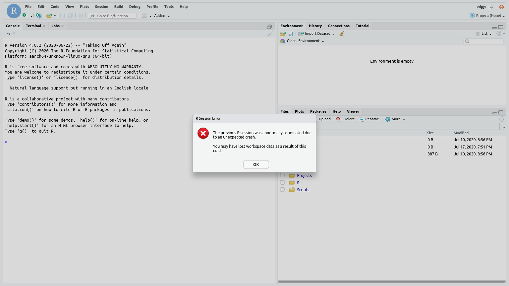

```{r, include = FALSE}
knitr::opts_chunk$set(
  collapse = TRUE,
  comment = "#>"
)
```

```{r setup}
```

## Docker operations

The two main user-visible components to a Docker package are an `image`, which
is a collection of software, and `containers`, where the software runs. In this
release there is a single image, `edgyr-ml`, and normally you will only be
running a single container, called `edgyr`.

In the following, all operations will occur on the Docker host in the directory
`~/Projects/edgyr/container-run-scripts`. I'm going to assume the host is a
Jetson Nano called "Nano".

### Pulling the image

Before you can use the image, you have to have it on your Docker host. To do
this, run the script `pull-image`:

```
znmeb@Nano:~/Projects/edgyR/container-run-scripts$ ./pull-image 
latest: Pulling from znmeb/edgyr-ml
3b5e2c02f523: Pulling fs layer 
b9448035bb0a: Pulling fs layer 

[snip]

464529f5c5bb: Pull complete 
248fad5e214b: Pull complete 
6de52330cbb9: Pull complete 
Digest: sha256:51265581fe03aae8fb6a2cbc28929a56b33229cf5656d04723ad5c9e78a121d0
Status: Downloaded newer image for znmeb/edgyr-ml:latest
docker.io/znmeb/edgyr-ml:latest
REPOSITORY          TAG                 IMAGE ID            CREATED             SIZE
znmeb/edgyr-ml      latest              a74882eb113b        19 hours ago        6.84GB
znmeb@Nano:~/Projects/edgyR/container-run-scripts$ 
```

### Running the image in a container
Once we've pulled the image, we need to create a container with the image and
start the service processes in it, in this case RStudio Server. We do this with
the `run-edgyr` script:

```
znmeb@Nano:~/Projects/edgyR/container-run-scripts$ export EDGYR_PASSWORD="12.angry%characters"
znmeb@Nano:~/Projects/edgyR/container-run-scripts$ ./run-edgyr 
Force-removing old 'edgyr' container
You can ignore errors if it doesn't exist
Error: No such container: edgyr
Running image znmeb/edgyr-ml:latest
867dcf8179966c9aa4472e8b0d71267106902a3da572b9ebb2e6bce5a3f2231d
CONTAINER ID        IMAGE                   COMMAND                  CREATED             STATUS              PORTS               NAMES
867dcf817996        znmeb/edgyr-ml:latest   "/docker-entrypoint.…"   13 seconds ago      Up 5 seconds                            edgyr
Resetting 'edgyr' password
Starting RStudio Server - browse to port 7878 on Docker host
znmeb@Nano:~/Projects/edgyR/container-run-scripts$ 
```

If you forget to define the `EDGYR_PASSWORD` variable, you'll get an error
message:

```
znmeb@Nano:~/Projects/edgyR/container-run-scripts$ ./run-edgyr 
You need to specify a new password for the 'edgyr'
account in the 'EDGYR_PASSWORD' environment variable.
The new 'edgyr' password must be at least 12 characters!
```

A Docker container is a collection of Linux processes that are isolated from
the host except for well-defined resource usages and behavior. When you did
`./run-edgyr`, the following things happened:

1. If there was already an `edgyr` container, Docker removed it.
2. Docker created a new container, called `edgyr`.
3. Docker set the filesystem of the container to the contents of the image,
`docker.io/znmeb/edgyr-ml`. This filesystem is independent of the host
filesystem; it's stored in a protected area that Docker manages.
4. Docker connected the container's network to the host network. This means any
ports that the processes in the container uses are bound to the host port with
the same numbers. For this image, that's port `7878` for RStudio Server and port
`8888` if you start up the JupyterLab service.
5. Docker started the container by running a script in the container called
`docker-entrypoint.sh`.
6. `docker-entrypoint.sh` read the `EDGYR_PASSWORD` environment variable and
set the password for the `edgyr` account in the container to that value.

All of this means you can now browse to port `7878` on the host Nano remotely,
or to port `7878` on `localhost` from the Nano console, and log in to RStudio
Server as `edgyr` with the password you set.

The host - container relationship is a bit like one-way mirrors. The processes
in the container can only see other processes running in the container, can
only read and write to filesystems we allow, which in this case is the
filesystem we created from the image with `./run-edgyr`.

We haven't restricted the container's CPU, GPU or RAM usage, but we could have
done so. And we have connected the container directly to the host network, but
we could have created an isolated virtual network that only the container and
other containers we specified could use.

### Stopping and restarting the container
Suppose we want to stop the container but keep all the files on its filesystem
intact. First, we stop the R session in the container from the RStudio Server
browser window:

```{r echo=FALSE, out.width='100%'}
knitr::include_graphics('./Screenshot_2020-07-11_RStudio_Server.png')
```

--------------------

Press the red button at the top right of the window to stop the R session. You
will see this:

```{r echo=FALSE, out.width='100%'}
knitr::include_graphics('./Screenshot_2020-07-17_RStudio_Server.png')
```

--------------------

***You need to do this before stopping the container.*** If you forget, you may
lose data, and you may see this warning when you bring it back up:

```{r echo=FALSE, out.width='100%'}

```

--------------------

After you've stopped the session, you can stop the container. There's a script
for that - `stop-edgyr`:

```
znmeb@Nano:~/Projects/edgyR/container-run-scripts$ ./stop-edgyr 
Stopping the 'edgyr' container
edgyr
CONTAINER ID        IMAGE                   COMMAND                  CREATED             STATUS                       PORTS               NAMES
867dcf817996        znmeb/edgyr-ml:latest   "/docker-entrypoint.…"   3 hours ago         Exited (137) 5 seconds ago                       edgyr
znmeb@Nano:~/Projects/edgyR/container-run-scripts$ 
```

Now if you try to log in from a browser you'll get an error message:

```{r echo=FALSE, out.width='100%'}
knitr::include_graphics('./screenshot-unable-to-connect.png')
```

--------------------

Once you've stopped the container, you can shut the host down or restart it and
your files will be there when you start everything up again.

To start the container back up again, we *start* the container, and there's a
script for that too - `start-edgyr`:

```
znmeb@Nano:~/Projects/edgyR/container-run-scripts$ ./start-edgyr 
Starting the 'edgyr' container
edgyr
CONTAINER ID        IMAGE                   COMMAND                  CREATED             STATUS              PORTS               NAMES
867dcf817996        znmeb/edgyr-ml:latest   "/docker-entrypoint.…"   3 hours ago         Up 5 seconds                            edgyr
znmeb@Nano:~/Projects/edgyR/container-run-scripts$ 
```

Note that there's a difference between `run-edgyr` and `start-edgyr`.
`run-edgyr` creates a fresh container, loads the image into it, sets up the
networking and then starts the container. `start-edgyr` only starts a stopped
container that already exists.

## Git and GitHub
The primary goal of the `edgyR` project is to provide an R / RStudio
package development environment for Jetson development kits. As a result, I
strongly encourage developers to use Git and GitHub for persistence and
collaboration rather than other means. The Nano is especially a one-person
machine; it only has 4 GB of RAM and a small filesystem by current standards.
See [@Wickham2015r] for more practical advice on R package development.

The first time you run an `edgyr` container, edit
`/home/edgyr/Scripts/edit-me-then-run-4-git-config.bash`. Enter your name and
email address as they appear on your GitHub repositories, and change the
credential caching time if two hours is too long or too short for your
workflow. Then run the script.

To clone a project, go into the `Projects` directory and use the `https` form
to specify the repository. The first time you push a commit, RStudio will ask
for your ID and "password". If you're using two-factor authentication as
GitHub recommends, the password is your personal access token (PAT). Git will
cache those credentials for the time you specified - two hours if you use the
default in the script.

## Next: Using JupyterLab

`vignette("kk-jupyter-lab")`

## References
