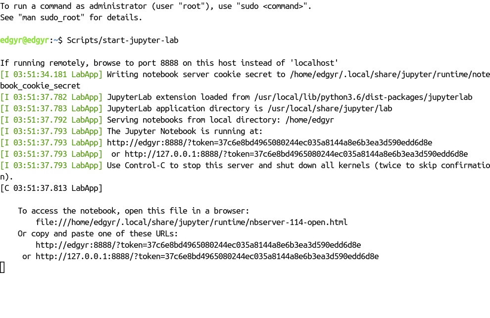
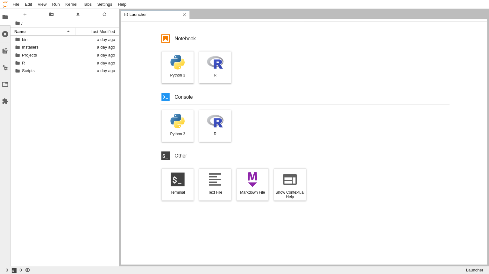

```{r, include = FALSE}
knitr::opts_chunk$set(
  collapse = TRUE,
  comment = "#>"
)
```

## Starting JupyterLab

The `edgyr-ml` image inherits JupyterLab ^[@jupyterlab2020] from the NVIDIA
`l4t-ml` image. ^[@NVIDIA2019d] As a result, all that necessary to use
JupyterLab is to add the Julia and R kernels a script to start up the service.
The `IJulia` package ^[ijulia2020] provides the Julia kernel and the `IRkernel`
package ^[@Kluyver2019] provides the R kernel. The startup script is
`/home/edgyr/Scripts/start-jupyter-lab`.

1. Browse to the RStudio Server either from the host console or remotely and
open the 'Terminal' pane.
2. Type `Scripts/start-jupyter-lab`. You'll see

```{r echo=FALSE, out.width='100%'}

```

--------------------

If you're on the Nano console, you just need to copy and paste the `http` link
into a browser tab and you'll be in the JupyterLab front page. If you're
connected remotely, copy the `http://edgyr` link, but replace `edgyr` with the
IP address of your Docker host. For example, mine is `192.168.254.23`:

```{r echo=FALSE, out.width='100%'}

```

--------------------

To stop the JupyterLab server, press `Control-C` twice as shown above. As with
RStudio Server and R packages, I strongly recommend putting your notebooks in
projects in the `Projects` directory and collaborating via Git / GitHub.

## Next

The next steps are up to you! Please feel free to open issues at
<https://github.com/znmeb/edgyR/issues/new>. Bug reports, documentation
questions and especially feature requests are fair game.

## References
